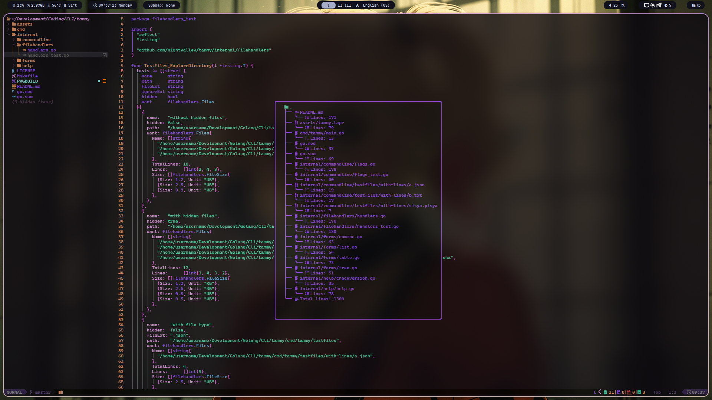

<div align="center">

# tammy


[About](#about) • [Installation](#installation) • [Usage](#usage) • [Configuring](#configuring) • [Using tammy in NeoVim](#adding-tammy-to-your-neovim)

</div>

# About
A small Cli-Utility that will calculate for you the number of lines in all files and directories starting from your current directory.
You can use this:
`alias countlines='pwd && echo "Total number of lines: $(cat $(fd -t file) | wc -l)"'`
and it can work even faster, but my program has some svistoperdelki, for example:
- you can only count lines in files that match the desired extension.
- the program can display a table, list or tree of files with the number of lines and their size.
- by default hidden files are not taken into account by the program, but the `-h` flag will fix this.

# Installation
- For install binary file from github release see: [Releases](https://github.com/nightvalley/tammy/releases/latest)
- Using make (for Arch Linux also use make build):
```sh
git clone https://github.com/nightvalley/tammy
cd tammy
make build
```

# Usage
Display information about files in the current directory:
```sh
tammy
```

## Flags
- `tammy -f`:
  + Change output format. Available forms: table, list, total, tree (default - table).
- `tammy -h`:
  + Show hidden files.
- `tammy -s`:
  + Show file size.
- `tammy -p`:
  + Specify the path to the directory in which to count lines. It is not necessary to specify the path. The path can also be specified at the very end: `tammy -f list -s -h ~/Documents`.
- `tammy -ft`:
  + Count lines only in files with a certain extension. Example: `tammy -ft md`, or `tammy -ft .md`.
- `tammy -i`:
  * Ignore files with file extension. Example: `tammy -i go`, or `tammy -i .go`
- `tammy -t`:
  + Show execution time.
- `tammy -help`:
  + Show help message.
- `tammy -version`:
  + Check for updates.

# Configuring
The utility is configured using environment variables. Available variables:
- `DEFAULT_FORM`
  + Available values:
    + `export DEFAULT_FORM="table"` - default
    + `export DEFAULT_FORM="list"`
    + `export DEFAULT_FORM="tree"`
    + `export DEFAULT_FORM="total"`
- `LIST_ENUMERATOR`
  + Available values:
    + `export LIST_ENUMERATOR="roman"` - default
    + `export LIST_ENUMERATOR="arabic"`
    + `export LIST_ENUMERATOR="dash"`
    + `export LIST_ENUMERATOR="alphabet"`
    + `export LIST_ENUMERATOR="bullet"`
    + `export LIST_ENUMERATOR="asterisk"`
- `TREE_ENUMERATOR`
  + Available values:
    + `export TREE_ENUMERATOR="rounded"` - default
    + `export TREE_ENUMERATOR="default_enumerator"`
    + `export TREE_ENUMERATOR="default_indenter"`
- `ALLWAYS_DISPLAY_SIZE`
  + Available values:
    + `export ALLWAYS_DISPLAY_SIZE="false"` - default
    + `export ALLWAYS_DISPLAY_SIZE="true"`
- `ALLWAYS_SHOW_HIDDEN_FILES`
  + Available values:
    + `export ALLWAYS_SHOW_HIDDEN_FILES="false"` - default
    + `export ALLWAYS_SHOW_HIDDEN_FILES="true"`

# Adding tammy to your Neovim
```lua
vim.api.nvim_create_user_command("Tammy", function(args)
  local buf = vim.api.nvim_create_buf(false, true)

  local output = vim.fn.system("tammy " .. args.args)
  local lines = vim.split(output, "\n")

  vim.api.nvim_buf_set_lines(buf, 0, -1, false, lines)

  local win_width = vim.o.columns
  local win_height = vim.o.lines

  local output_line_count = #lines
  local height = math.max(1, math.min(output_line_count + 2, math.floor(win_height * 0.8)))

  local max_line_length = 0
  for _, line in ipairs(lines) do
    max_line_length = math.max(max_line_length, vim.fn.strdisplaywidth(line))
  end

  local width = math.min(max_line_length + 4, math.floor(win_width * 0.8))

  local row = math.floor((win_height - height) / 2)
  local col = math.floor((win_width - width) / 2)

  local tammy_win = vim.api.nvim_open_win(buf, true, {
    border = "rounded",
    relative = "editor",
    width = width,
    height = height,
    row = row,
    col = col,
  })

  vim.bo[buf].swapfile = false
  vim.wo[tammy_win].wrap = false
  vim.wo[tammy_win].number = false
  vim.wo[tammy_win].relativenumber = false
  vim.bo[buf].buftype = "nofile"
  vim.bo[buf].bufhidden = "hide"
  vim.bo[buf].filetype = "man"

  vim.api.nvim_create_autocmd("WinLeave", {
    callback = function()
      if vim.api.nvim_win_is_valid(tammy_win) then
        vim.api.nvim_win_close(tammy_win, true)
      end
    end,
    group = vim.api.nvim_create_augroup("TammyWindowClose", { clear = true }),
    buffer = buf,
  })
end, {
  nargs = "*",
  complete = function()
    return { "-f list", "-f tree", "-ft ", "-h" }
  end,
})
```

